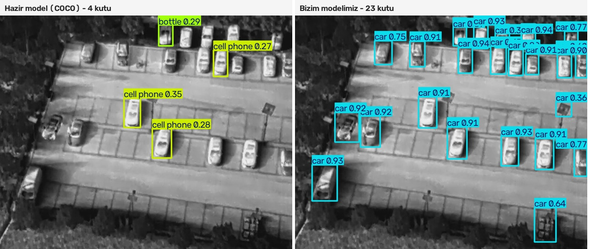
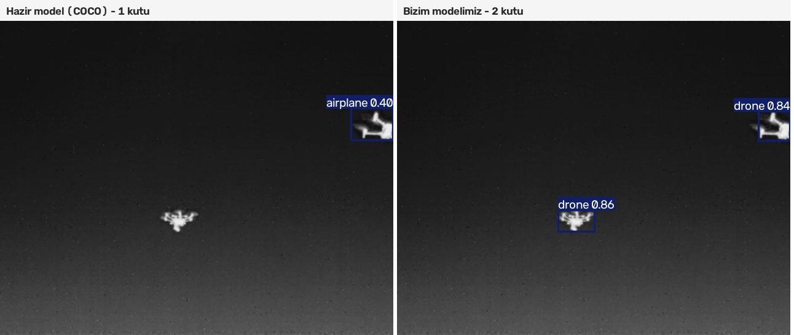
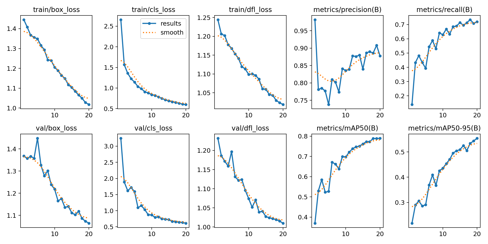
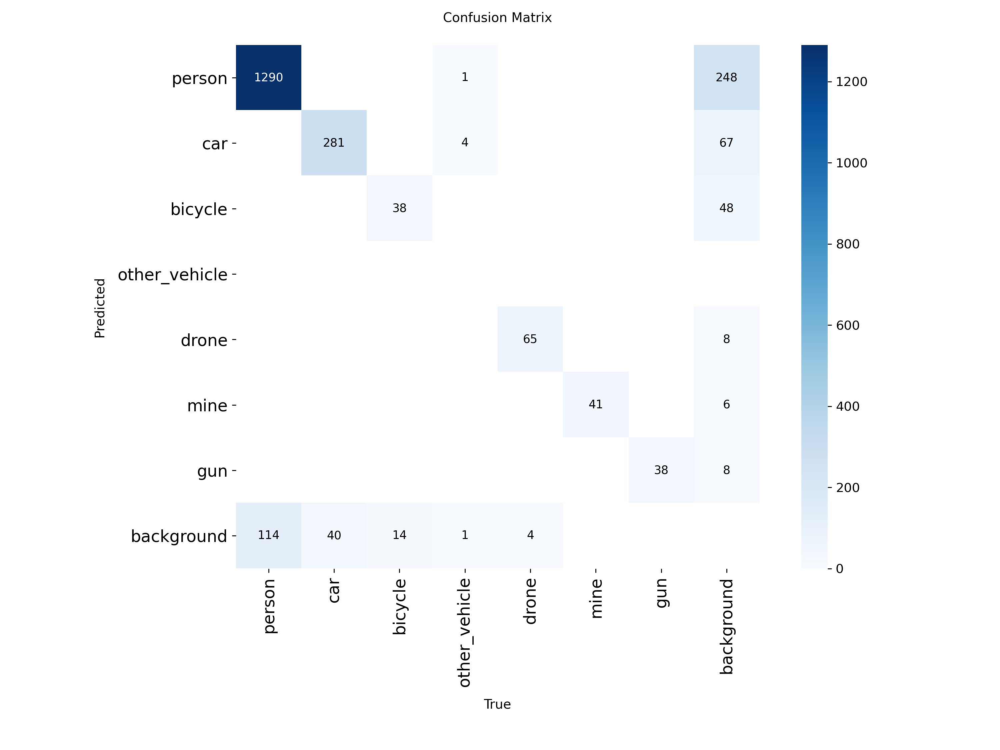

# İHA Görüntü İşleme — OpenCV Öğrenme Projesi

Staj kapsamında OpenCV ile görüntü işlemeyi sıfırdan öğrenip **YOLO ile İHA görüntülerinde nesne tespiti** yapmaya ilerlediğim çalışma.

**Başlangıç:** 15 Eylül 2026 · **Repo açılışı:** 21 Eylül 2026

**Takip için:**
- 🗺️ **Yol haritası** → aşağıda
- 📓 **Öğrenme günlüğü** (her gün ne öğrendim, nerede zorlandım) → [`GUNLUK.md`](GUNLUK.md)
- 🧪 **Kendi yazdığım kodlar** → [`notebooks/`](notebooks/) (00: temeller, 01: gerçek veri)
- 📦 **Veri seti** → [`data/README.md`](data/README.md)

## Kurulum

```bash
python3 -m venv .venv
source .venv/bin/activate
pip install -r requirements.txt
jupyter notebook notebooks/
```

## Veri

[Aerial UAV Thermal – Inferred Unified Dataset](https://www.kaggle.com/datasets/umuttuygurr/aerial-uav-thermal-inferred-unified-dataset) (CC0). 27.925 kuşbakışı, İHA ve termal görüntü; 7 sınıf için YOLO etiketleri var.
Tamamı 13 GB. Yerelde yalnızca küçük bir alt küme (`data/`, git'e girmez) kullanılır, tam eğitim Kaggle Notebook'ta (GPU) yapılır.

## Yol haritası (hedef: YOLO ile nesne tespiti)

| # | Aşama | Konu |
|---|-------|------|
| 1 | Görüntü temelleri ✅ | piksel, shape, dilimleme, renkli görüntü/BGR, dosyadan okuma, kutu çizme |
| 2 | YOLO etiket formatı ✅ | `sınıf x y g y` satırını piksel koordinatına çevirme, etiketleri resmin üstüne çizme |
| 3 | Veri setini tanıma ✅ | sınıf dağılımı, kutu boyutları, RGB ve termal farkı, train/val/test |
| 4 | Nesne tespiti kavramları ✅ | sınırlayıcı kutu, IoU, güven skoru, NMS, precision/recall, mAP |
| 5 | Hazır YOLO modeli ✅ | `ultralytics` ile tahmin, sonuçları okuma ve çizme |
| 6 | Eğitim (Kaggle GPU) ✅ | `data.yaml`, epoch, loss eğrileri, overfitting |
| 7 | Değerlendirme ✅ | hata analizi, küçük nesneler, termal görüntülerdeki performans |

## Sonuçlar

Kaggle'da ücretsiz Tesla T4 GPU ile eğitildi: `yolo11n`'den transfer öğrenme, 3.000 eğitim + 600 doğrulama fotoğrafı, 20 epoch, ~20 dakika.

**v2 modeli (10.000 foto / 40 epoch): mAP50 = 0.857 · mAP50-95 = 0.642 · Precision = 0.863 · Recall = 0.816**

*(İlk model v1 — 3.000 foto / 20 epoch: mAP50 0.789. Karşılaştırma: [`notebooks/08_gelistirilmis_model.ipynb`](notebooks/08_gelistirilmis_model.ipynb))*

### Hazır model vs kendi modelim

Kuşbakışı termal otopark (gerçekte 20 araba + 1 diğer araç):



COCO ile eğitilmiş hazır model kuşbakışı termal görüntüde çuvallıyor: 4 kutu buluyor ve arabalara *cell phone* / *bottle* diyor. Sebep **alan farkı (domain gap)** — model eğitim verisinde arabaları hep yandan görmüş, tepeden bakınca araba yalnızca parlak bir dikdörtgen.

Gökyüzünde İHA (hazır model bu sınıfı hiç tanımıyor):



### Sınıf bazlı başarı

| Sınıf | Doğrulamadaki nesne | mAP50 |
|---|---|---|
| mine | 41 | 0.991 |
| gun | 38 | 0.978 |
| drone | 69 | 0.938 |
| person | 1404 | 0.930 |
| car | 321 | 0.926 |
| bicycle | 52 | 0.627 |
| other_vehicle | 6 | 0.133 |

`other_vehicle` ve `bicycle` için doğrulamada çok az örnek var, bu iki sınıfın sayıları istatistiksel olarak güvenilir değil.

### Eğitim eğrileri



Train ve val kayıpları birlikte düşüyor, yani **ezberleme yok**. mAP eğrileri 20. epoch'ta hâlâ yükseliyor: daha uzun eğitim daha iyi sonuç verecek.

### Karışıklık matrisi



Model `other_vehicle` sınıfı için hiç tahmin yapmamış; gerçekteki 6 nesnenin 4'üne *car* demiş. Sınıflar arası başka karışıklık neredeyse yok; hatalar çoğunlukla yanlış alarm ve kaçırma şeklinde.

### Açık maddeler

1. **`other_vehicle`**: veri setinde yalnızca 148 örnek var, öğrenilmiyor. Daha fazla örnek toplanmalı ya da `car` ile birleştirilmeli.
2. **Daha uzun eğitim**: mAP eğrileri düzleşmeden eğitim bitti; 50+ epoch ve daha çok veri denenmeli.
3. **Kestirme öğrenme testi**: her sınıf tek bir kaynaktan geliyor (mayınlar `munitions`, İHA'lar `uav2uav`...). Model nesneyi mi, yoksa fotoğrafın türünü mü tanıyor? Farklı ortamdan örneklerle sınanmalı.


## Klasör yapısı

```
notebooks/
  00_calisma.ipynb             # Aşama 1-2: temeller ve YOLO etiketleri (sahte sahne)
  01_gercek_veri.ipynb         # Aşama 3: gerçek İHA fotoğrafları ve etiketleri
  02_etiket_gorsellestirme.ipynb # Aşama 3: etiketleri çizen fonksiyon + kutu boyutu analizi
  03_iou_ve_basari.ipynb       # Aşama 4: IoU, precision/recall, mAP
  04_hazir_model.ipynb         # Aşama 5: hazır YOLO modelini termal görüntülerde denemek
  05_kendi_modelim.ipynb       # Aşama 6-7: Kaggle GPU'da eğitim + hazır modelle karşılaştırma
  06_degerlendirme.ipynb       # Aşama 7: test ölçümü, kestirme öğrenme deneyi, klasik OpenCV karşılaştırması
  07_video.ipynb               # Video üzerinde tespit
  08_gelistirilmis_model.ipynb # v2 modeli: 10.000 foto / 40 epoch, v1 ile karşılaştırma
egitim_sonuclari/              # eğitim grafikleri (results, confusion matrix, örnek tahminler)
models/                        # model dosyaları (git'e girmez)
  ek_goruntu_numpy_dizisi.ipynb  # ek kaynak: hazır ders notu (görüntü = NumPy dizisi)
data/                          # veri seti (git'e girmez, bkz. data/README.md)
outputs/                       # üretilen görüntüler (git'e girmez)
GUNLUK.md                      # öğrenme günlüğü
```

Not: `00_calisma.ipynb`'deki bazı hücreler `outputs/ders01_sahne.png` ve `outputs/ders01_sahne.txt` (örnek YOLO etiketi) dosyalarını okur. `outputs/` git'e girmediği için bu dosyalar repoda yok. Görüntü `ek_goruntu_numpy_dizisi.ipynb` çalıştırılınca üretilir.
