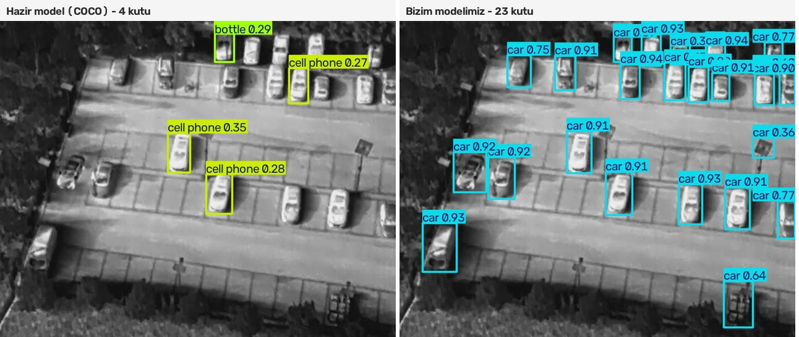
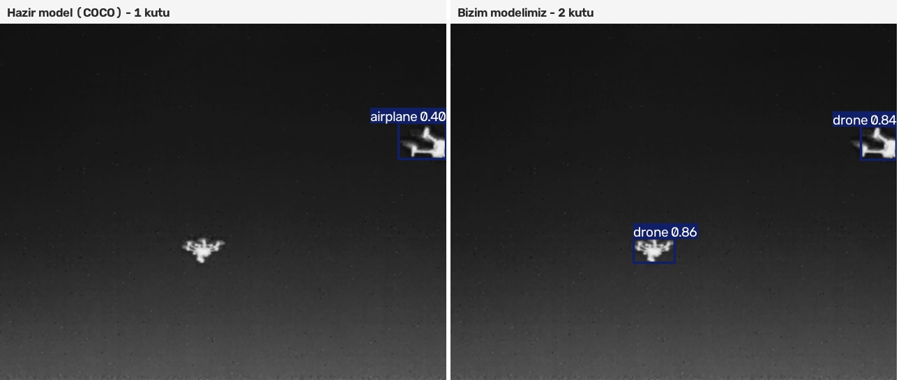
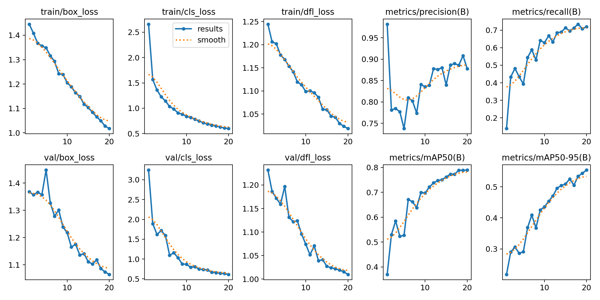
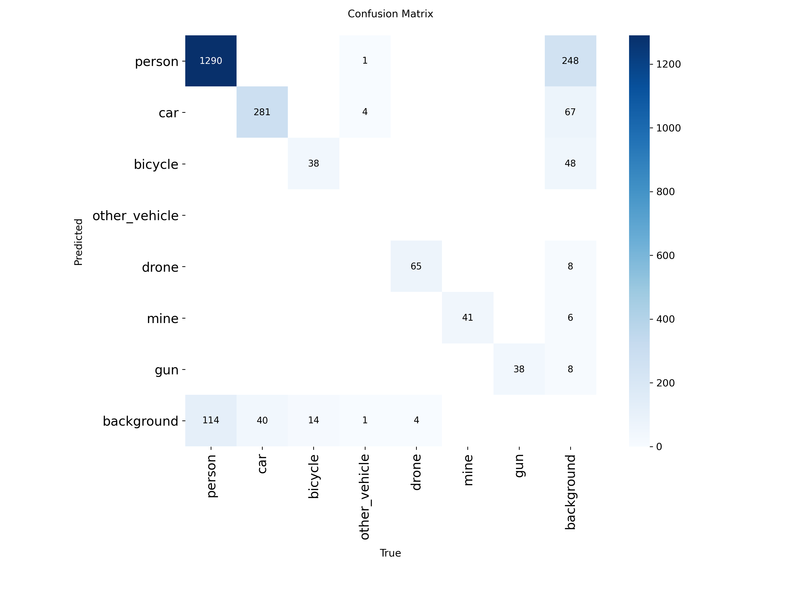
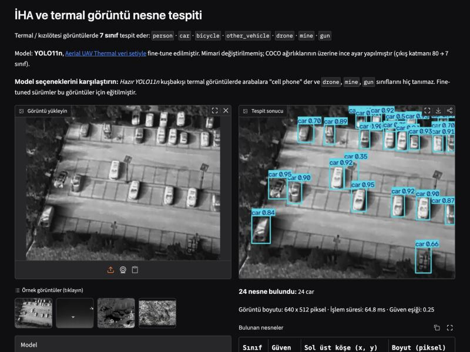
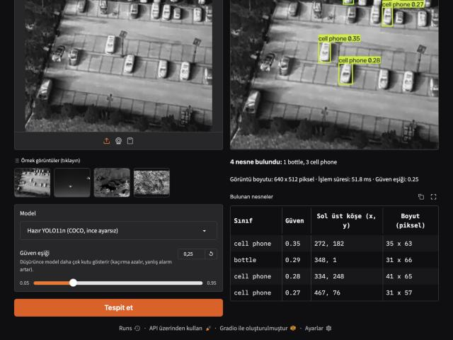
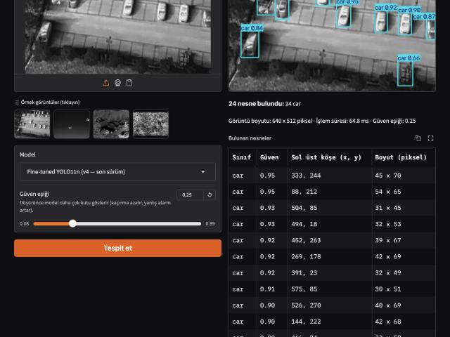

# İHA Görüntü İşleme — OpenCV Öğrenme Projesi

Staj kapsamında OpenCV ile görüntü işlemeyi sıfırdan öğrenip **YOLO ile İHA görüntülerinde nesne tespiti** yapmaya ilerlediğim çalışma.

**Başlangıç:** 15 Eylül 2026 · **Repo açılışı:** 21 Eylül 2026

**Takip için:**
- 🗺️ **Yol haritası** → aşağıda
- 📓 **Öğrenme günlüğü** (her gün ne öğrendim, nerede zorlandım) → [`GUNLUK.md`](GUNLUK.md)
- 🧪 **Kendi yazdığım kodlar** → [`notebooks/`](notebooks/) (00: temeller, 01: gerçek veri)
- 📦 **Veri seti** → [`data/README.md`](data/README.md)

## Kurulum

```bash
python3 -m venv .venv
source .venv/bin/activate
pip install -r requirements.txt
jupyter notebook notebooks/
```

## Veri

[Aerial UAV Thermal – Inferred Unified Dataset](https://www.kaggle.com/datasets/umuttuygurr/aerial-uav-thermal-inferred-unified-dataset) (CC0). 27.925 kuşbakışı, İHA ve termal görüntü; 7 sınıf için YOLO etiketleri var.
Tamamı 13 GB. Yerelde yalnızca küçük bir alt küme (`data/`, git'e girmez) kullanılır, tam eğitim Kaggle Notebook'ta (GPU) yapılır.

## Yol haritası (hedef: YOLO ile nesne tespiti)

| # | Aşama | Konu |
|---|-------|------|
| 1 | Görüntü temelleri ✅ | piksel, shape, dilimleme, renkli görüntü/BGR, dosyadan okuma, kutu çizme |
| 2 | YOLO etiket formatı ✅ | `sınıf x y g y` satırını piksel koordinatına çevirme, etiketleri resmin üstüne çizme |
| 3 | Veri setini tanıma ✅ | sınıf dağılımı, kutu boyutları, RGB ve termal farkı, train/val/test |
| 4 | Nesne tespiti kavramları ✅ | sınırlayıcı kutu, IoU, güven skoru, NMS, precision/recall, mAP |
| 5 | Hazır YOLO modeli ✅ | `ultralytics` ile tahmin, sonuçları okuma ve çizme |
| 6 | Eğitim (Kaggle GPU) ✅ | `data.yaml`, epoch, loss eğrileri, overfitting |
| 7 | Değerlendirme ✅ | hata analizi, küçük nesneler, termal görüntülerdeki performans |

### Yöntem notu: fine-tuning

Bu projede **yeni bir model mimarisi tasarlanmadı**. Kullanılan model hazır `yolo11n` mimarisidir; COCO ile eğitilmiş ağırlıkların üzerine kendi termal veri setimizle **ince ayar (fine-tuning)** yapıldı. Değişen tek yapısal öğe, çıkış katmanının 80 sınıf yerine 7 sınıfa göre yeniden boyutlandırılmasıdır (`nc=80 → nc=7`).

Eğitim çıktısındaki `Transferred 451/499 items from pretrained weights` satırı bunu gösterir: modelin 499 parçasından 451'i hazır ağırlıklardan geldi.

## Sonuçlar

Kaggle'da ücretsiz Tesla T4 GPU ile eğitildi: `yolo11n`'den transfer öğrenme, 3.000 eğitim + 600 doğrulama fotoğrafı, 20 epoch, ~20 dakika.

**v2 modeli (10.000 foto / 40 epoch): mAP50 = 0.857 · mAP50-95 = 0.642 · Precision = 0.863 · Recall = 0.816**

*(İlk model v1 — 3.000 foto / 20 epoch: mAP50 0.789. Karşılaştırma: [`notebooks/08_gelistirilmis_model.ipynb`](notebooks/08_gelistirilmis_model.ipynb))*

### Hazır model vs fine-tuned YOLO11n

Kuşbakışı termal otopark (gerçekte 20 araba + 1 diğer araç):



COCO ile eğitilmiş hazır model kuşbakışı termal görüntüde çuvallıyor: 4 kutu buluyor ve arabalara *cell phone* / *bottle* diyor. Sebep **alan farkı (domain gap)** — model eğitim verisinde arabaları hep yandan görmüş, tepeden bakınca araba yalnızca parlak bir dikdörtgen.

Gökyüzünde İHA (hazır model bu sınıfı hiç tanımıyor):



### Sınıf bazlı başarı

| Sınıf | Doğrulamadaki nesne | mAP50 |
|---|---|---|
| mine | 41 | 0.991 |
| gun | 38 | 0.978 |
| drone | 69 | 0.938 |
| person | 1404 | 0.930 |
| car | 321 | 0.926 |
| bicycle | 52 | 0.627 |
| other_vehicle | 6 | 0.133 |

`other_vehicle` ve `bicycle` için doğrulamada çok az örnek var, bu iki sınıfın sayıları istatistiksel olarak güvenilir değil.

### Eğitim eğrileri



Train ve val kayıpları birlikte düşüyor, yani **ezberleme yok**. mAP eğrileri 20. epoch'ta hâlâ yükseliyor: daha uzun eğitim daha iyi sonuç verecek.

### Karışıklık matrisi



Model `other_vehicle` sınıfı için hiç tahmin yapmamış; gerçekteki 6 nesnenin 4'üne *car* demiş. Sınıflar arası başka karışıklık neredeyse yok; hatalar çoğunlukla yanlış alarm ve kaçırma şeklinde.

### Tam test kümesinde ölçüm (fine-tuned v4)

Eğitimde ve model seçiminde hiç kullanılmamış **2.798 fotoğraf / 8.748 nesne** üzerinde:

| Sınıf | Nesne | mAP50 | Recall |
|---|---|---|---|
| mine | 182 | 0.992 | 0.989 |
| gun | 187 | 0.952 | 0.963 |
| person | 5.930 | 0.943 | 0.933 |
| car | 1.694 | 0.931 | 0.911 |
| drone | 367 | 0.931 | 0.935 |
| bicycle | 378 | 0.648 | 0.758 |
| other_vehicle | 10 | 0.435 | 0.300 |
| **Genel** | **8.748** | **0.833** | 0.827 |

Çıkarım hızı: **3,0 ms/görüntü** (Tesla T4) → saniyede ~330 kare, gerçek zamanlı video için yeterli.

**Küçük test kümesi neden yanıltır?** Aynı ölçüm daha önce yalnızca 72 fotoğrafla yapılmıştı:

| Sınıf | 72 fotoğrafla | 2.798 fotoğrafla |
|---|---|---|
| other_vehicle | **0.000** (6 nesne) | **0.435** (10 nesne) |
| bicycle | 0.765 (52 nesne) | 0.648 (378 nesne) |
| drone | 0.967 (13 nesne) | 0.931 (367 nesne) |

Küçük örneklem hem iyimser hem kötümser hatalar üretti: `other_vehicle` sıfır görünüyordu (model bu sınıfı hiç öğrenememiş gibi), `bicycle` ise olduğundan iyi. Az örnekli sınıflarda tek bir tespitin sonucu uçurması bu yüzden mümkün.

### Kestirme öğrenme ve yapay veriyle çözümü

Model `drone` sınıfında mAP50 0.94 alıyordu, ama bir İHA'yı kesip asfalta yapıştırdığımızda **göremiyordu**. Veri setindeki bütün İHA'lar tek kaynaktan geliyor ve hepsinin arka planı gökyüzü; model "İHA şekli" yerine "düz koyu arka planda parlak leke" kuralını öğrenmişti.

Veriyi üç katına çıkarmak (v2) sorunu çözmedi — sorun miktar değil **çeşitlilikti**. Çözüm olarak İHA kesitlerini farklı arka planlara rastgele konum ve boyutlarda yapıştırıp **1.500 yapay eğitim fotoğrafı** ürettim; yapıştırma koordinatları bilindiği için etiketler otomatik yazıldı (copy-paste augmentation).

Adil karşılaştırma: aynı 3.000 gerçek fotoğraf, aynı model, aynı epoch — tek değişken yapay veri.

| Test | v1 (yapay yok) | **v3 (yapay var)** |
|---|---|---|
| İHA farklı arka planlarda (5 sahne) | 2/5 | **5/5** |
| Video, otopark arka planı (100 kare) | 1/100 | **100/100** |
| Görülmemiş İHA kesitleri (24 deneme) | 5/24 (güven 0.52) | **23/24 (güven 0.95)** |
| Doğrulama mAP50 | 0.789 | 0.797 |

**Yan etki ölçüldü ve o da giderildi.** v3'te model gökyüzündeki arabaları `drone` sanmaya başladı (24 denemenin 17'sinde). Kestirme tek yönlü kırılmıştı. Çözüm: **karşı örnek** — gökyüzüne araba, insan ve bisiklet yapıştırıp kendi sınıflarıyla etiketlemek (750 örnek, v4).

| Test | v1 | v3 | **v4** |
|---|---|---|---|
| İHA gökyüzü olmayan sahnelerde (5 sahne) | 2/5 | 5/5 | **5/5** |
| İHA video, otopark arka planı (100 kare) | 1/100 | 100/100 | **100/100** |
| Görülmemiş İHA kesitleri (24 deneme) | 5/24 | 23/24 | **23/24** |
| Gökyüzünde araba doğru bilinen (24) | 11/24 | 2/24 | **22/24** |
| Gökyüzünde insan doğru bilinen (24) | 14/24 | 12/24 | **24/24** |
| Doğrulama drone mAP50 | 0.938 | 0.919 | **0.954** |

v4 hem v3'ün kazanımını korudu hem yan etkiyi giderdi; gökyüzündeki nesneleri ayırt etmede **v1'i de geçti**.

Ayrıntı: [`notebooks/09_yapay_veri.ipynb`](notebooks/09_yapay_veri.ipynb) · yan etki analizi: [`notebooks/10_yan_etki.ipynb`](notebooks/10_yan_etki.ipynb)

### Açık maddeler

1. **`other_vehicle`**: veri setinde yalnızca 148 örnek var, öğrenilmiyor. Daha fazla örnek toplanmalı ya da `car` ile birleştirilmeli.
2. **Daha uzun eğitim**: mAP eğrileri düzleşmeden eğitim bitti; 50+ epoch ve daha çok veri denenmeli.
3. **Kestirme öğrenme testi**: her sınıf tek bir kaynaktan geliyor (mayınlar `munitions`, İHA'lar `uav2uav`...). Model nesneyi mi, yoksa fotoğrafın türünü mü tanıyor? Farklı ortamdan örneklerle sınanmalı.


## Demo arayüzü

Görüntü yükleyip tespit sonuçlarını görmek için basit bir web arayüzü (Gradio):

```bash
python app.py
```

Tarayıcıda `http://127.0.0.1:7860` açılır.



Aynı görüntü, **hazır YOLO11n** ile: arabalara `cell phone` diyor ve 24 aracın yalnızca 4'üne kutu çiziyor.



Her tespit için sınıf, güven skoru, konum ve kutu boyutu tablo halinde listelenir:



| Özellik | Açıklama |
|---|---|
| **Görüntü yükleme** | Sürükle-bırak ya da dosya seçerek; dört hazır örnek de var (`ornekler/`) |
| **Model seçimi** | Fine-tuned v4 (son sürüm) · Fine-tuned v1 (ilk sürüm) · Hazır YOLO11n (COCO) |
| **Güven eşiği** | 0.05–0.95 arası kaydırıcı; precision–recall dengesi canlı görülür |
| **Özet** | Bulunan nesne sayısı, sınıf dökümü, görüntü boyutu, işlem süresi |
| **Tablo** | Her nesne için sınıf, güven skoru, sol üst köşe ve kutu boyutu |

Model seçicinin amacı karşılaştırma: fine-tuning'in etkisi aynı görüntüde tek tıkla görülebiliyor.

## Klasör yapısı

```
app.py                         # demo arayüzü (Gradio)
kaggle/                        # Kaggle eğitim betiği ve ham notebook
ornekler/                      # arayüz için örnek görüntüler
notebooks/
  00_calisma.ipynb             # Aşama 1-2: temeller ve YOLO etiketleri (sahte sahne)
  01_gercek_veri.ipynb         # Aşama 3: gerçek İHA fotoğrafları ve etiketleri
  02_etiket_gorsellestirme.ipynb # Aşama 3: etiketleri çizen fonksiyon + kutu boyutu analizi
  03_iou_ve_basari.ipynb       # Aşama 4: IoU, precision/recall, mAP
  04_hazir_model.ipynb         # Aşama 5: hazır YOLO modelini termal görüntülerde denemek
  05_fine_tuning.ipynb       # Aşama 6-7: YOLO11n fine-tuning (Kaggle GPU) + hazır modelle karşılaştırma
  06_degerlendirme.ipynb       # Aşama 7: test ölçümü, kestirme öğrenme deneyi, klasik OpenCV karşılaştırması
  07_video.ipynb               # Video üzerinde tespit
  08_gelistirilmis_model.ipynb # v2 modeli: 10.000 foto / 40 epoch, v1 ile karşılaştırma
  09_yapay_veri.ipynb          # copy-paste augmentation: kestirme öğrenmeyi kırma deneyi
  10_yan_etki.ipynb            # çözümün yan etkisi: gökyüzündeki araba/insan karışması
egitim_sonuclari/              # eğitim grafikleri (results, confusion matrix, örnek tahminler)
models/                        # model dosyaları (git'e girmez)
  ek_goruntu_numpy_dizisi.ipynb  # ek kaynak: hazır ders notu (görüntü = NumPy dizisi)
data/                          # veri seti (git'e girmez, bkz. data/README.md)
outputs/                       # üretilen görüntüler (git'e girmez)
GUNLUK.md                      # öğrenme günlüğü
```

Not: `00_calisma.ipynb`'deki bazı hücreler `outputs/ders01_sahne.png` ve `outputs/ders01_sahne.txt` (örnek YOLO etiketi) dosyalarını okur. `outputs/` git'e girmediği için bu dosyalar repoda yok. Görüntü `ek_goruntu_numpy_dizisi.ipynb` çalıştırılınca üretilir.
